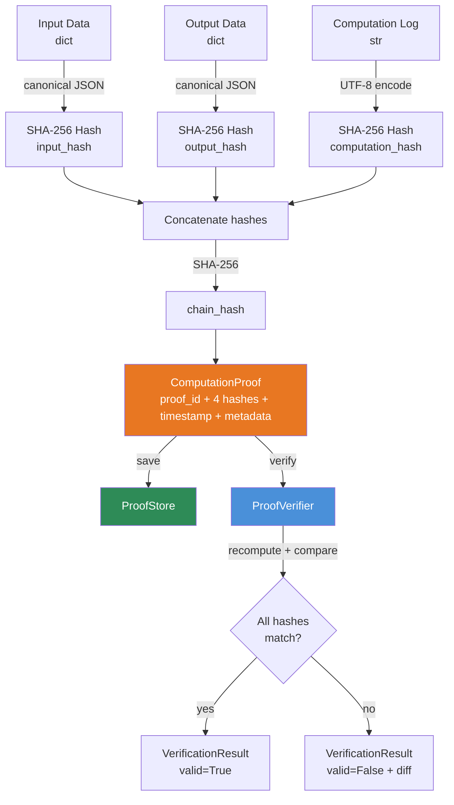

# aumai-proofserve

**Verifiable computation for agent outputs.**

Part of the [AumAI](https://github.com/aumai) open-source agentic AI infrastructure suite.

[](LICENSE)
[](https://www.python.org/)
[](https://github.com/aumai)

---

## What Is This?

When a bank teller counts cash, a second teller counts it again. When a pharmaceutical company
runs a clinical trial, an independent auditor verifies the data. The principle is the same: for
high-stakes outputs, you need a way to prove that a computation was performed correctly on
specific inputs — without trusting the person (or agent) who performed it.

`aumai-proofserve` applies this principle to AI agent outputs. Every time an agent completes a
computation — classifying a document, generating a contract, evaluating a risk score — it
generates a `ComputationProof`: a set of SHA-256 cryptographic hashes that bind the input data,
output data, and computation log together with a single chain hash.

Later, anyone with access to the original inputs and outputs can run `ProofVerifier.verify()` to
independently confirm that the proof matches. If the inputs were altered, the output was modified,
or the computation log was tampered with, the chain hash will not match and the proof is invalid.

The result is a lightweight, dependency-free way to provide cryptographic evidence that an agent
"did what it said it did."

---

## Why Does This Matter?

### The Attribution Problem

When an AI agent produces an output — a risk assessment, a legal summary, a financial projection
— someone eventually asks: "How do we know the model actually processed these exact inputs?" Without
a proof mechanism, the honest answer is: "You don't. You have to trust the system."

For regulated industries (finance, healthcare, legal), "trust the system" is not an acceptable
answer.

### Tamper Detection

Audit logs and databases can be edited after the fact. A SHA-256 chain hash cannot. The chain
hash is a mathematical function of the exact bytes of the input, output, and computation log. If
any of those bytes change — even a single character — the chain hash changes. There is no way to
alter the evidence without breaking the proof.

### Zero-Dependency Verification

The verification algorithm is four SHA-256 operations and four string comparisons. Any auditor
with Python 3.11 and `pydantic` can reproduce it independently. There is no vendor SDK, no API
call, no proprietary format. The proof is self-contained and eternally verifiable.

---

## Architecture



### Hash Chain Construction

```
input_hash       = SHA-256( canonical_json(input_data) )
output_hash      = SHA-256( canonical_json(output_data) )
computation_hash = SHA-256( computation_log.encode("utf-8") )
chain_hash       = SHA-256( input_hash + output_hash + computation_hash )
```

`canonical_json` sorts all keys alphabetically and uses `ensure_ascii=False`, producing a
deterministic byte sequence regardless of the order keys were inserted into the dict.

---

## Features

- **SHA-256 hash chain** — Four hashes (input, output, computation, chain) provide independent
  and combined tamper detection.
- **Canonical JSON serialization** — Sorted keys guarantee that `{"b": 2, "a": 1}` and
  `{"a": 1, "b": 2}` produce identical hashes.
- **Deterministic verification** — Recomputing hashes from scratch is the only verification
  step; no stored secrets, no signatures, no PKI.
- **`ProofStore`** — In-memory proof registry with `save`, `get`, `list_proofs`, `delete`,
  `dump` and `load` for full persistence round-trips.
- **CLI** — `prove`, `verify`, and `list` commands for scripting proof generation and
  verification in CI/CD pipelines.
- **Pydantic v2 models** — All proof structures are validated at creation; no silent corruption.
- **Zero cryptographic library dependencies** — Uses only Python's built-in `hashlib`.
- **Metadata annotations** — Attach arbitrary key-value metadata (agent ID, model version,
  run ID) to every proof without affecting the hashes.

---

## Quick Start

### Installation

```bash
pip install aumai-proofserve
```

### Python — 60-second example

```python
from aumai_proofserve.core import ProofGenerator, ProofVerifier, ProofStore

# 1. Generate a proof
generator = ProofGenerator()

proof = generator.generate_proof(
    input_data={"document_id": "DOC-9981", "user_query": "Summarize section 3."},
    output_data={"summary": "Section 3 covers liability clauses...", "word_count": 42},
    computation_log="Step 1: Extracted section 3. Step 2: Applied summarization model.",
    metadata={"agent_id": "legal-agent-01", "model": "gpt-4o"},
)

print(f"Proof ID    : {proof.proof_id}")
print(f"Chain hash  : {proof.chain_hash}")

# 2. Store the proof
store = ProofStore()
store.save(proof)

# 3. Verify the proof later
verifier = ProofVerifier()
result = verifier.verify(
    proof=proof,
    input_data={"document_id": "DOC-9981", "user_query": "Summarize section 3."},
    output_data={"summary": "Section 3 covers liability clauses...", "word_count": 42},
    computation_log="Step 1: Extracted section 3. Step 2: Applied summarization model.",
)

print(f"Valid: {result.valid}")
print(result.details)
```

### Detecting Tampering

```python
# Tampered output — even one word changed
tampered_result = verifier.verify(
    proof=proof,
    input_data={"document_id": "DOC-9981", "user_query": "Summarize section 3."},
    output_data={"summary": "Section 3 covers liability clauses...", "word_count": 43},  # changed
    computation_log="Step 1: Extracted section 3. Step 2: Applied summarization model.",
)

print(f"Valid: {tampered_result.valid}")   # False
print(tampered_result.details)
# Verification failed:
# output_hash mismatch: expected '...' got '...'
# chain_hash mismatch: expected '...' got '...'
```

---

## CLI Reference

The CLI is installed as `aumai-proofserve`.

### `prove` — Generate a proof from JSON files

```bash
aumai-proofserve prove \
  --input ./input.json \
  --output ./output.json \
  --log ./computation.log \
  --proof-out ./proof.json \
  --store ./proof_store.json
```

| Flag | Default | Required | Description |
|------|---------|----------|-------------|
| `--input` | — | yes | Path to JSON file containing the computation input |
| `--output` | — | yes | Path to JSON file containing the computation output |
| `--log` | None | no | Path to text file containing the computation log |
| `--proof-out` | `proof.json` | no | Path to write the generated proof JSON |
| `--store` | `proof_store.json` | no | Path to the persistent proof store |

Example output:

```
Proof generated: 3fa85f64-5717-4562-b3fc-2c963f66afa6
  input_hash      : a3f1e2c4b7d8...
  output_hash     : 9d4c7b2e1a8f...
  computation_hash: 5b8e3d9c6f1a...
  chain_hash      : 2c7f1a4e8b3d...
  Written to      : proof.json
```

---

### `verify` — Verify a proof against original data

```bash
aumai-proofserve verify \
  --proof ./proof.json \
  --input ./input.json \
  --output ./output.json \
  --log ./computation.log
```

| Flag | Default | Required | Description |
|------|---------|----------|-------------|
| `--proof` | — | yes | Path to the proof JSON file |
| `--input` | — | yes | Path to the original input JSON file |
| `--output` | — | yes | Path to the original output JSON file |
| `--log` | None | no | Path to the original computation log file |

Exits with code `0` on success, `1` on failure.

Success output:

```
VALID   Proof 3fa85f64-5717-4562-b3fc-2c963f66afa6
        All hashes verified successfully.
```

Failure output (stderr):

```
INVALID Proof 3fa85f64-5717-4562-b3fc-2c963f66afa6
Verification failed:
output_hash mismatch: expected '9d4c7b2e1a8f...' got 'ff3a19b2c441...'
chain_hash mismatch: expected '2c7f1a4e8b3d...' got '7e2d9b4c1a5f...'
```

---

### `list` — List all proofs in the store

```bash
aumai-proofserve list --store ./proof_store.json
```

| Flag | Default | Description |
|------|---------|-------------|
| `--store` | `proof_store.json` | Path to the proof store |

Example output:

```
3fa85f64-5717-4562-b3fc-2c963f66afa6  2025-11-01T12:00:00  chain=2c7f1a4e8b3d...
a1b2c3d4-5e6f-7a8b-9c0d-e1f2a3b4c5d6  2025-11-01T13:15:22  chain=9f3a18b2c441...
```

---

## Python API Examples

### Batch Proof Generation

```python
from aumai_proofserve.core import ProofGenerator, ProofStore

generator = ProofGenerator()
store = ProofStore()

computations = [
    {
        "input": {"contract_id": "C-001", "clause": 5},
        "output": {"risk_level": "low", "score": 0.12},
        "log": "Evaluated clause 5 against risk rubric v3.",
    },
    {
        "input": {"contract_id": "C-002", "clause": 8},
        "output": {"risk_level": "high", "score": 0.87},
        "log": "Clause 8 contains indemnification language; flagged high-risk.",
    },
]

for comp in computations:
    proof = generator.generate_proof(
        input_data=comp["input"],
        output_data=comp["output"],
        computation_log=comp["log"],
    )
    store.save(proof)
    print(f"Saved proof {proof.proof_id} | chain={proof.chain_hash[:16]}...")

print(f"\nTotal proofs in store: {len(store.list_proofs())}")
```

### Persisting the Proof Store

```python
import json
from aumai_proofserve.core import ProofStore

store = ProofStore()
# ... generate and save proofs ...

# Persist to disk
with open("proof_store.json", "w") as f:
    json.dump(store.dump(), f, indent=2)

# Restore in a new process
new_store = ProofStore()
with open("proof_store.json") as f:
    new_store.load(json.load(f))

for proof in new_store.list_proofs():
    print(f"{proof.proof_id} | {proof.timestamp.isoformat()[:19]}")
```

### Audit Workflow: Prove and Verify in CI

```python
import json
from pathlib import Path
from aumai_proofserve.core import ProofGenerator, ProofVerifier

# --- At agent runtime: generate proof ---
generator = ProofGenerator()
input_data = json.loads(Path("agent_input.json").read_text())
output_data = json.loads(Path("agent_output.json").read_text())
computation_log = Path("agent_run.log").read_text()

proof = generator.generate_proof(
    input_data=input_data,
    output_data=output_data,
    computation_log=computation_log,
    metadata={"pipeline_run": "ci-run-2025-11-01-001"},
)
Path("proof.json").write_text(proof.model_dump_json(indent=2))

# --- Later in CI verification job ---
loaded_proof = ... # ComputationProof.model_validate(json.loads(Path("proof.json").read_text()))
verifier = ProofVerifier()
result = verifier.verify(
    proof=loaded_proof,
    input_data=input_data,
    output_data=output_data,
    computation_log=computation_log,
)

if not result.valid:
    raise AssertionError(f"Proof verification failed: {result.details}")
```

---

## Configuration

`aumai-proofserve` requires no configuration. The hashing algorithm is fixed at SHA-256.
The store file path is passed at the call site via the Python API or the CLI `--store` flag.

To use a different storage backend, serialize with `store.dump()` and persist to your system:

```python
import json
import psycopg2  # example
from aumai_proofserve.core import ProofStore

store = ProofStore()
# ... populate ...

conn = psycopg2.connect(DATABASE_URL)
conn.execute(
    "INSERT INTO proof_archive (data) VALUES (%s)",
    [json.dumps(store.dump())]
)
```

---

## How It Works — Deep Dive

### Canonical JSON

The single biggest source of non-determinism in JSON hashing is key ordering. Python dicts
preserve insertion order since 3.7, but two dicts with the same contents in different order
produce different JSON strings and therefore different hashes.

`aumai-proofserve` solves this with `_canonical_json()`:

```python
json.dumps(data, sort_keys=True, ensure_ascii=False).encode("utf-8")
```

`sort_keys=True` ensures lexicographic key ordering at every nesting level. `ensure_ascii=False`
preserves Unicode characters (e.g. `"Zürich"`) verbatim rather than escaping them as `\u00fc`,
which would change the byte representation without changing the semantic content.

### Chain Hash Construction

The chain hash binds all three component hashes together in a defined concatenation order:

```
chain_input = (input_hash + output_hash + computation_hash).encode("ascii")
chain_hash  = SHA-256(chain_input)
```

The component hashes are 64-character lowercase hex strings (256 bits each), so the chain input
is always 192 ASCII characters (1536 bits). This fixed-width concatenation eliminates length-
extension ambiguity.

### Verification Algorithm

`ProofVerifier.verify()` recomputes all four hashes from scratch and compares them to the stored
proof. It reports every mismatch, not just the first, so you can immediately see whether inputs,
outputs, the computation log, or multiple components were altered.

The comparison is done with `==` on Python strings (constant-time in CPython for equal-length
strings of the same type), which is sufficient for offline audit use cases.

### ProofStore Ordering

`list_proofs()` returns proofs sorted by `timestamp` (ascending) using Python's `sorted()` with
a `key=lambda p: p.timestamp` function. This produces a stable chronological ordering suitable
for audit log display.

---

## Integration with Other AumAI Projects

| Project | Integration Pattern |
|---------|-------------------|
| **aumai-transparency** | Pass `trail.model_dump_json()` as the `computation_log` argument to `ProofGenerator.generate_proof()`. The resulting proof cryptographically binds the audit trail to the agent's inputs and outputs. |
| **aumai-otel-genai** | Store the OTel `trace_id` and `span_id` in `ComputationProof.metadata` so that each proof can be traced back to the exact distributed trace that recorded it. |

---

## Contributing

Contributions are welcome. Please read `CONTRIBUTING.md` before opening a pull request.

```bash
git checkout -b feature/my-change
make test
make lint
```

All new public APIs must include docstrings and corresponding tests.

---

## License

Apache License 2.0 — see [LICENSE](LICENSE) for full text.

Copyright 2025 AumAI Contributors.
